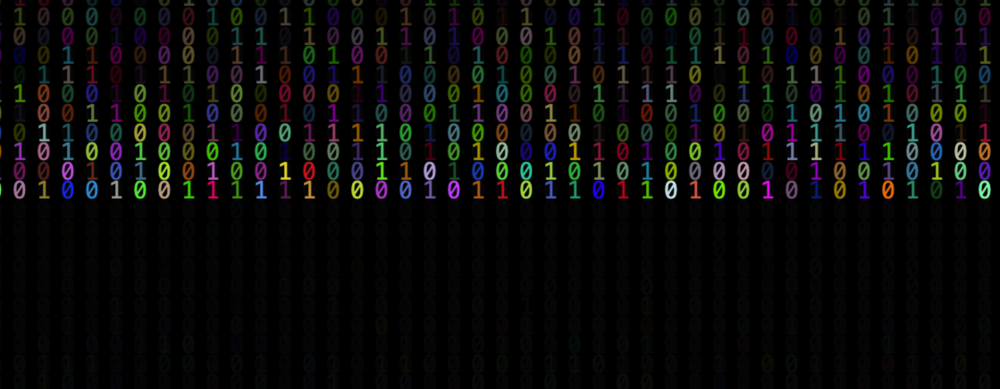

#  Code Precipitation

A programm written in JavaScript to create a snow fall effect on the screen. The code uses HTML5 Canvas API for rendering graphics. The example illustrates what object oriented programming (OOP) is and how it can be used to create a more efficient, maintainable codebase. Object Oriented Programming (OOP) organises data and methods that operate on that data in objects. Everything is represented by objects and those objects are manipulated using methods.


## Usage

1. Clone the repository:
   ```bash
   git clone https://github.com/tpreisig/laughing-engine.git
   ```
2. Navigate to the project directory:
   ```bash
   cd lauging-engine
   ```
3. Start a webapp in browser:
   ```bash
   open ./index.html
   ```

## License

This project is licensed under the MIT License - see the [LICENSE](LICENSE) file for details.

## Screenshots



## Contact

Maintained by tpreisig - feel free to reach out!
